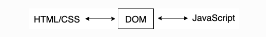

# DOM

1. DOM이란?

- 웹페이지의 HTML을 계층화시켜 **트리구조**로 만든 객체(Object) 모델
- JavaScript는 이 model로 웹 페이지에 접근하고, 페이지를 수정할 수 있다.
- DOM은 HTML인 웹페이지와 스크립팅언어(JavaScript)를 서로 잇는 역할

2. DOM을 사용하는 이유

document객체는 DOM트리의 root node에 접근하게 해주는데
document객체로 요소(element)에 접근하듯이 요소의 속성(attribute)에도 접근해 class, id도 추가하고 style과 요소의 내용을 수정할 수 있다.

⛔️ JS에서 style 수정할 때 hypen(-)은 사용할 수 없다. Object에서 프로퍼티 이름에 `-`을 사용할 수 없던 이유와 같다.

# Event

1. Event란?

- 클릭, 마우스, 스크롤 등 다양함
- js를 이용해 event를 입력받으면 html, css, js 등을 조작할 수 있음

이벤트의 종류는 [이곳](https://developer.mozilla.org/ko/docs/Web/API/EventTarget/addEventListener)에서 확인한다.

2. event를 이용하기 위해선?

element에 이벤트를 이용한 함수를 사용하기 위해서는 `element.addEventListener(이벤트 종류,callbackFunc)`를 사용한다.
`callback funcion`에서는 event를 인자로 받고 실행하는데 이것을 통해 이벤트가 무엇을 할 것인지 설정할 수 도 있다.

`event.target` 은 event가 발생한 요소를 의미
`event.preventDefault();` 브라우저에서 기본적으로 발생하는 event, 즉 `a`나 `submit`같은 창이 새로고침이 되는 event를 방지할 수 있다.

여러가지가 있지만 위의 두가지를 제일 많이 사용한다.

3. key 이벤트

- 키보드를 눌렀을 때 발생하는 keydown
- 키보드를 누르고 떼는 순간 발생하는 keyup
- 키보드를 눌러 어떤 텍스트가 작성되는 순간 발생하는 keypress

`e.code`를 통해 입력값이 무엇인지 알 수 있다.

4. 👀 주의

- input의 value값을 가져오기 위해선 사용할 함수 안에서 변수 선언을 해줘야한다.

# CSS

1. ul이나 ol의 list 점이나 숫자를 없애려면 `list-style-type: none;`를 사용한다.
2. margin,padding의 개념에 대해서 좀 더 공부가 필요함
