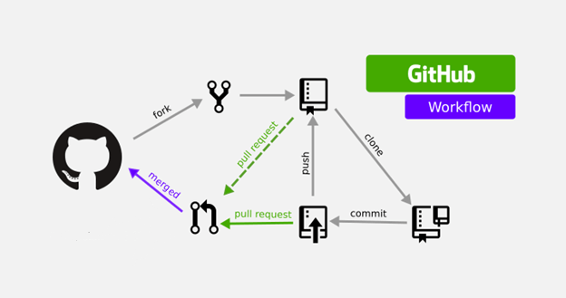

# git

1. git이란

   - VCS (Version Control System)이다.

2. 코드 버전 관리를 하는 이유는?

   - 수정할떄마다 파일을 새로 만들면 힘들기 떄문.
   - 이전의 코드로 돌아갈 수 있기 떄문.
   - 이력을 남기기 위해
   - 하나의 프로젝트를 여러명이 함께 협업할 수 있기 떄문에

3. git의 명령어

   - git 시작 : `git init`
   - git 상태 확인 : `git status`
   - 파일 수정 이력 기록 준비 : `git add filename` | `git add .`는 전체 파일을 의미
   - 파일 수정 이력 기록 : `git commit`
   - commit 이력 보기 : `git log`

4. 순서

   1. 파일 생성 후 작성 (untraked)
   2. `git add .` traked
   3. `commit`을 통해 어떤 사항인지
   4. `push`을 통해 commit을 repo(github)에 저장

5. branch

   - `git branch`를 통해 현재 어떤 branch들이 존재하는지 알 수 있다.
   - `git checkout branchname` branchanme으로 이동 할 수 있다.
   - `git pull origin main` 으로 main으로 있는 branch를 받아올 수 있다.
   - `git branch feature/name`으로 name branch를 만들 수 있다.
     - branch에서 pull requset하기 위해선
       1. push를 하고 난후 내가 clone해온 즉, PR를 만드는 링크가 터미널에 나온다.
       2. 링크를 타면 PR를 하는 페이지로 이동하게 된다.
       3. PR 내용을 작성 후 등록한다.
       4. git workflow에 따라 master가 받아들이면 내 branch를 merge 후 merge된 사항들을 내 local에 두기 위해선 `git pull`을 한다.

6. `git init`은 한번만!
   - `git init`은 local에게 내가 이제부터 이 파일을 형상관리한다라고 알려주는 것이기 때문에 한번만 하면 된다. git의 log나 commit 을 초기화 시켜주는게 아니다!

# github

1. github이란

   - git을 이용한 프로젝트의 저장소

2. one repository for one project

   - 하나의 repo는 하나의 프로젝트를 위해 사용한다.
   - 직관적이고 관리가 편하다.

3. github의 workflow

   

# DOM

1. 오늘 알게 된 DOM.

   - 만약 `innerHTML`이나 `createElement`등을 통해 동적으로 생성된 node는 함수 내에서 이용하지 않는 한 그 함수의 범위 밖에서는 해당 element를 불러 올 수 없다.

2. ## querySelectorAll에서 반복해서 모든 버튼에 이벤트 등록하는 방법

   ````for(const button of heartBtn){
   button.addEventListener("click",heart)}```
   ````

   - `for in`과 `for of`

     - `for in`는 배열과 object에서 각각 index, key 값과 함께 value를 반환한다.
     - `for of`는 상속된 열거 가능한 속성들을 포함하여 객체에서 문자열로 키가 지정된 모든 열거 가능한 속성에 대해 반복 / 반환값은 value만

   - `map()`을 사용하면 오류가 나고 `for of`를 사용하면 작동이 된다. 왜 이럴까?
     - `const heartBtn = document.querySelectorAll(".heartIcon");`은 데이터 타입이 Object이다,

# 느낀점

Symbol.iterable이란?
git의 활용법에 대해 조금 더 공부를 해야겠다.
